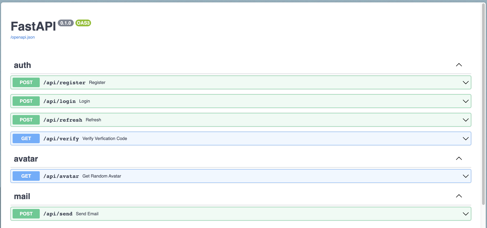

# FastAPI and MongoDB project template

A simple starter for building RESTful APIs with FastAPI and MongoDB.


## Features

### Dependency injection

The boilerplate use dependency injection techniques extensively using the [injector](https://pypi.org/project/injector/), where I extended standard FastAPI class based view using [FastAPI Utilities](https://fastapi-utils.davidmontague.xyz/user-guide/class-based-views/#the-cbv-decorator) to consolidate the endpoint signatures and reduce the number of repeated dependencies. Although some people might consider the extensive use of DI in Python an overkill since you have module imports, I still prefer to use it to have better control over instances initialization, easier testing and clearer dependency graph.

### Authentication

Authentication is performed via JWT access tokens + JWT refresh tokens (which are rotated at every refresh and stored in the database in order to allow session banning): with appropriate secret-sharing mechanisms, this configuration prevents the need for backend services to call a stateful user session holder (e.g. Redis) on every API call.
Access tokens are saved in localStorage whilst refresh token are stored inside secure, HTTP only cookies.

### Redis

There are two redis instances used for caching user data in order improve the performance of the API, Rate limiting of API calls with redis to prevent brute force attacks and Pub/Sub for sending messages/Notifications to the frontend.

## Installation

The API application can be installed by cloning the repository and running the following commands:


Start by cloning the repo:

```bash
git clone https://github.com/digital-lab-development/eduvacity-v2.git
```

Then start up all the needed containers (databases):

```bash
docker-compose up -d
```


Next, create a virtual environment and install the application dependencies:

This project uses poetry for dependency management. To install poetry, follow the instructions on the [poetry website](https://python-poetry.org/docs/#installation).

or install with pip:

```bash
pip install poetry
```

```console
poetry shell && poetry install
```


Start the application:

```console
uvicorn main:app --port 8000 --reload
```


